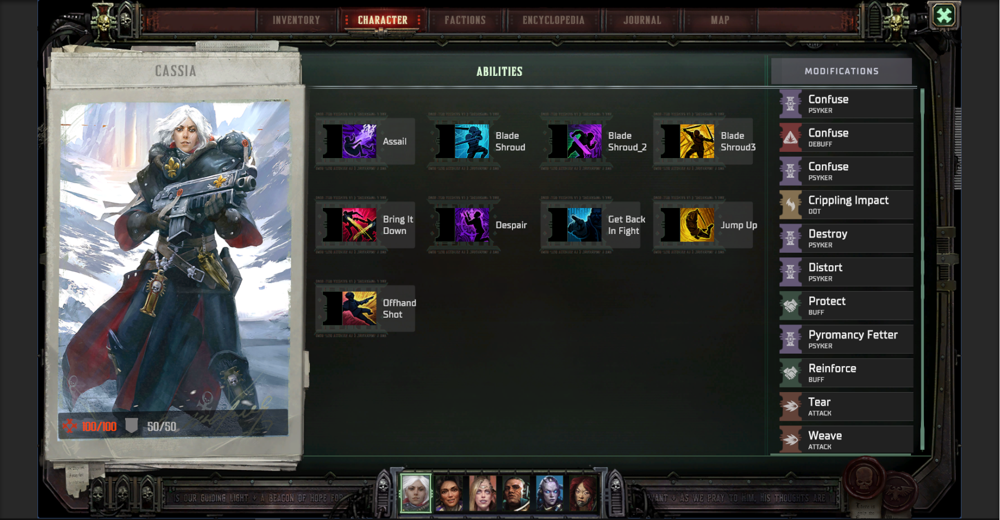

#  Party Management UI (Unity, MVVM)

##  Обзор проекта

Данный проект представляет собой систему управления отрядом (Party UI), реализованную в Unity с использованием архитектурного подхода **MVVM (Model–View–ViewModel)**.
https://github.com/Denis1337-star/TestMirHobby/blob/main/Screenshot/PlayMod.png

Система позволяет:

* выбирать персонажей
* управлять их способностями
* назначать модификаторы через drag & drop
* визуально отслеживать совместимость и состояние

Основной упор сделан на:

* чистую архитектуру
* масштабируемость
* оптимизацию UI
* удобство взаимодействия

---
## Геймплей
https://github.com/Denis1337-star/TestMirHobby/blob/main/Screenshot/Gameplay_Video.mp4

##  Архитектура

Проект построен с разделением ответственности между слоями:

---

###  Model (Данные)

ScriptableObject конфиги:

* `CharacterDefinition`
* `AbilityDefinition`
* `ModificationDefinition`

Runtime-слой (состояние в игре):

* `CharacterRuntimeData`
* `AbilityRuntimeData`
* `ModificationRuntimeData`

 Runtime-данные отделены от конфигов, чтобы:

* не изменять ScriptableObject
* корректно работать с игровым состоянием
* упростить расширение (save/load)

---

###  ViewModel (Логика)

* `PartyViewModel`

Отвечает за:

* выбор персонажа
* получение списков abilities/modifications
* проверку совместимости
* назначение и снятие модификаторов
* уведомление UI через события

---

###  View (UI)

Основные UI-компоненты:

* `PartyPanelView` — список персонажей (аватары)
* `CharacterDetailsView` — информация о персонаже
* `AbilitiesView` — список способностей
* `ModificationsView` — список модификаторов
* `AbilitySlotView` — UI ability
* `ModificationSlotView` — UI модификатора
* `ModificationDragPreview` — визуал перетаскивания

---

###  Controller (Связующий слой)

* `PartyScreenController`

Отвечает за:

* связывание ViewModel и UI
* обработку пользовательского ввода
* управление drag & hover состояниями
* предотвращение конфликтов (hover vs drag)

---

## ⚙️ Функционал

###  Управление персонажами

* динамическое переключение персонажей
* подсветка активного персонажа
* обновление UI в реальном времени

---

###  Система способностей

* у каждого персонажа свой набор abilities
* возможность назначения модификаторов
* визуальное отображение состояния

---

###  Система модификаторов

* drag & drop
* проверка совместимости
* подсветка доступных целей
* снятие модификатора через ПКМ

---

###  Взаимодействие

* hover-подсветка
* drag preview
* корректная работа при быстрых действиях

---

##  Оптимизация UI

###  Разделение Canvas

UI разбит на несколько Canvas:

* статический (фон, рамки)
* динамический (списки, выбор)
* drag слой (preview)

 Это уменьшает количество пересборок UI

---

###  Sprite Atlas

Используются отдельные атласы:

* `Static` — фон, рамки, декор
* `Icon` — иконки
* `Character` — маленькие аватары
* `Ability` — большие портреты

 Это уменьшает draw calls и улучшает batching

---

###  Batching

Оптимизация за счет:

* использования атласов
* уменьшения количества Canvas
* отключения лишних Raycast Target

---

### 🧪 Тестирование производительности

Использовались инструменты Unity:

* **Stats**

  * Batches
  * SetPass Calls

* **Frame Debugger**

  * анализ draw calls
  * проверка batching

* **Profiler**

  * Canvas rebuild
  * CPU нагрузка

---

##  Работа с текстурами

### Подход:

* исходные текстуры → **Compression = None**
* сжатие происходит в Sprite Atlas

---

##  Архитектурные решения

### Почему MVVM

* разделение логики и UI
* удобство поддержки
* масштабируемость

---

### Почему Runtime-слой

* независимость от ScriptableObject
* корректная работа состояния
* готовность к расширению

---

### Почему разделение Canvas

* уменьшение rebuild UI
* повышение производительности

---

### Почему разделение атласов

* контроль памяти
* уменьшение draw calls
* гибкость загрузки

---

##  Итог

В проекте реализованы:

* архитектура MVVM
* система drag & drop
* разделение данных и логики
* оптимизированный UI
* чистая и расширяемая структура

Проект демонстрирует практический подход к разработке UI в Unity с учетом производительности и архитектуры.

---
